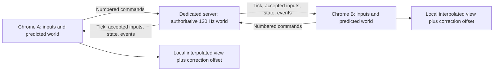

# Multiplayer plan: dedicated-server 1v1 alpha

Research date: September 6, 2026, America/Denver (September 7 UTC).
Code inspected: `6ca26248ceebd4d255f68ea8e3f608e4bff7a421`.
Confirmed scope: 1v1, current desktop Chrome, central North America, fewer than 10 testers.
Status: historical research and initial feasibility measurements. Multiplayer is now implemented; see [the alpha operating guide](multiplayer-alpha.md) for the final architecture, fixes, deployment, and verification. The measurements and unresolved questions below describe the original investigation, not the completed implementation.

## Recommendation

Keep the current Rapier physics and handling. Extract a shared, headless TypeScript simulation, run it at 120 Hz on a dedicated server, and run a predicted copy on each client. Reconcile the entire interacting world—both cars and the ball—against authoritative server updates. Preserve responsiveness through local prediction and correct the displayed result with bounded visual smoothing.

Start with two fixed player slots and invite-only rooms on one central-US host. Replace player/bot identity assumptions with stable entity and team IDs, but do not build larger matches, matchmaking, host migration, or distributed room infrastructure for this alpha.

The first implementation milestone should be a replayable simulation and collision test harness. A socket connection is easier than correctly undoing a ball touch, flip reset, demolition, or goal. The two material technical risks already found are oversized Rapier checkpoints and an unresolved full-snapshot replay hash discrepancy.

## What “exact physics” can mean

There are three separate requirements:

| Requirement | Target |
| --- | --- |
| One agreed match result | The dedicated server owns every collision outcome, score, boost pickup, demolition, and match transition. |
| Reproducible simulation | Identical complete starting state and accepted inputs should reproduce the same gameplay state; test the actual deployed builds. |
| Identical immediate pictures on both screens | Cannot be guaranteed while also responding immediately to inputs that have not yet crossed the network. |

For example, when both players challenge the ball, neither browser immediately knows the opponent's latest steering or jump. Each can briefly predict a different contact. The server resolves one outcome, and both clients converge to it. Lower latency and better prediction reduce visible corrections; a dedicated server cannot eliminate the information delay.

Also distinguish multiplayer consistency from reproducing Rocket League's original physics. This project uses Rapier and custom vehicle forces, rather than a frame-exact Rocket League simulation. Networking should preserve this game's tuned behavior.

## What Psyonix publicly documented

Jared Cone's 2018 GDC slides describe Bullet at a fixed 120 Hz, complete server authority, buffered client inputs, and prediction of all physics actors. They explain why predicting the car while interpolating the ball creates mismatched timelines. Corrections restore historical actors and replay subsequent physics. The documented design does not use server-side lag compensation; unpredictable cars remain harder to predict than the ball. These are historical engineering disclosures, not verification of the current proprietary implementation. See [Psyonix's GDC presentation](https://media.gdcvault.com/gdc2018/presentations/Cone_Jared_It_Is_Rocket.pdf), especially PDF pages 6, 89, 106, 133–138, 143–163, and 177.

Epic's support documentation still describes queued input frames and STS/CSTS feedback that adjusts client simulation pacing to manage that queue. It also notes the latency cost of excessive buffering. See [Rocket League input buffering settings](https://www.epicgames.com/help/c-202300000001622/c-202300000001682/rocket-league-input-buffering-settings-a202300000016971?lang=en-US).

The remainder of this document is a proposed design for this repository. Its rates, budgets, and milestones are our starting choices, not claimed Rocket League settings.

## Findings in this codebase

| Area | Existing behavior | Required change |
| --- | --- | --- |
| Fixed timestep | [config.ts](/home/amwill/Applications/rl-astra/src/config.ts:7) defines 1/120; Rapier uses it. | Retain one fixed simulation step on both sides. Never substitute render delta or packet intervals. |
| Headless physics | [physics.ts](/home/amwill/Applications/rl-astra/src/physics.ts:30) runs in Node through the existing Vite SSR test approach. | Bundle the same simulation for Node and Chrome; Three's math types do not require a renderer. |
| Match lifecycle | [game.ts](/home/amwill/Applications/rl-astra/src/game.ts:144) mixes ticking, scoring, UI, audio, and bots. | Extract match rules, phase timers, goals, and reset scheduling into shared simulation state. |
| Rendering feeds physics | [game.ts](/home/amwill/Applications/rl-astra/src/game.ts:169) gets the goal blast origin from the explosion object's position. | Store the origin in simulation state. Effects consume it. |
| Hidden gameplay state | [physics.ts](/home/amwill/Applications/rl-astra/src/physics.ts:21) stores jump, flip, boost, recovery, contact and demolition state outside Rapier. | Include it in save/restore and authoritative updates as appropriate. |
| Two-car assumptions | [physics.ts](/home/amwill/Applications/rl-astra/src/physics.ts:415) explicitly updates `player` then `bot`. Pickup and collision rules use identity checks. | Use two stable slots in canonical order, independent of which browser controls which car. |
| Input edges | [controls.ts](/home/amwill/Applications/rl-astra/src/controls.ts:127) consumes a queued jump; [game.ts](/home/amwill/Applications/rl-astra/src/game.ts:202) clears it after the first substep. | Record immutable per-tick commands. Retransmission and replay must not create additional jump presses. |
| Existing smoothing | [render.ts](/home/amwill/Applications/rl-astra/src/render.ts:239) interpolates adjacent local physics poses. | Keep this, and add a separate bounded correction offset for networking. |
| Local pause/reset | [game.ts](/home/amwill/Applications/rl-astra/src/game.ts:76) pauses on tab hiding; local actions reset the car and match. | Menus affect local controls only in online play. Server owns resets, match progression, and rules. |

Run offline practice through the extracted simulation too, so online and offline handling cannot quietly diverge. The bot becomes another input producer, disabled in a human 1v1.

## Measurements and limits

The [reproducible probe](/home/amwill/Applications/rl-astra/docs/research/multiplayer-feasibility.mjs) uses real game physics in Node. Its [recorded output](/home/amwill/Applications/rl-astra/docs/research/multiplayer-feasibility.json) came from Linux x64, Ryzen 9 9950X, Node 26.7.0, and Rapier 0.19.3. Run it with:

```sh
node docs/research/multiplayer-feasibility.mjs
```

| Measurement | Recorded result | Interpretation |
| --- | --- | --- |
| Physics step after warmup | 0.034 ms median; 0.150 ms p95 over 960 steps | Encouraging headless cost; not a hosted-server or worst-case benchmark. |
| Full Rapier snapshot | 12,265,550 bytes | Too large for routine network updates or a full snapshot every tick. |
| Full snapshot creation | 2.45 ms median over 12 samples | Much more expensive than an ordinary physics step. |
| Full snapshot restoration | 2.73 ms median; first measured restore about 7.78 ms | Tail cost matters for correction frames. |
| Replaying 120 physics ticks | About 7.28 ms, excluding restoration | Measured on this fast desktop without rendering. |
| Two independent worlds, 1,200 identical input ticks | Full snapshot hashes and sampled observable state matched at all 10 checkpoints | Same-process evidence only. |
| Restore/replay through ball strike and demolition | Observable state and event sequences matched | These scenarios actually produced a hit and a demolition. |
| Fresh-world wall drive | Observable state matched at every replayed tick for 240 ticks; final full snapshot hash differed | Unresolved engine-state/serialization discrepancy. Do not claim complete bitwise replay determinism. |

The arena contributes 86,404 triangles. Removing the three dynamic bodies from one measured world left a snapshot of 12,264,542 bytes, versus 12,266,129 before removal. The static world dominates the cost; this subtraction is not a valid dynamic-state serialization format.

At the measured size, 120 full checkpoints occupy about 1.47 GB before overhead. Sending them 60 times per second would be about 736 MB/s **per client** before transport overhead. Small player count does not make that workable.

The wall discrepancy reproduces with a fresh-world setup, while a wall case following other scenarios matched the full hash. The cause is not established. Isolate it with smaller Rapier-only cases, inspect differing bytes/state, and extend replay duration and collision coverage. Matching two seconds of motion is insufficient to dismiss an internal-state difference.

These probes do not exercise `Game` lifecycle rollback, network corrections, asymmetric delay, Chrome versus Node, other CPU architectures, or sustained room load. They establish feasibility and reveal constraints; they do not validate multiplayer.

## Shared simulation and determinism

Introduce a narrow simulation API:

```ts
step(commandsForBothSlots): SimEvents
captureCheckpoint(): Checkpoint
restoreCheckpoint(checkpoint): void
captureNetworkState(): AuthoritativeState
applyNetworkState(state): void
```

Each state represents the world **after** a numbered physics tick. Include a match epoch so a late packet from before a restart cannot affect the new match. Order body creation, input application, contacts, pad contention, and gameplay events consistently by stable entity ID. Never process “my car first.” This preserves determinism; the tie rule for truly simultaneous pickup/hit cases must also be explicit and symmetric where practical.

Rapier documents cross-platform determinism for its WASM version under identical versions, initial conditions, and construction order. It specifically cautions that JavaScript transcendental functions can break deterministic initialization. This project's arena generation and vehicle math use such functions, including Three quaternion operations. Chrome-only reduces the test matrix but does not prove equivalence with Node or across CPU architectures. See [Rapier determinism](https://rapier.rs/docs/user_guides/javascript/determinism/).

Pin the exact Rapier/WASM and simulation build, transmit a build/arena hash during connection, and reject mismatches. Bake collision mesh bytes once per build instead of independently generating them on each machine. Compare recorded command streams in the server runtime and supported Chrome builds. Investigate any divergence before adding quantization or changing math; if necessary, move sensitive operations to deterministic WASM or fixed lookup data.

A complete checkpoint must include Rapier state plus car mechanics, pad cooldowns, phase and match clocks, score, overtime, pending blast origin/tick, respawn scheduling, accepted input state, edge-consumption state, entity membership, and any future gameplay RNG. Presentation caches and effects stay outside it. Rebind body/collider wrappers after restoring a new Rapier world. Rapier's actual API is `world.takeSnapshot()` / `World.restoreSnapshot()`; see [serialization documentation](https://rapier.rs/docs/user_guides/javascript/serialization/) and the installed type declarations.

## Prediction and reconciliation



Both clients simulate both cars and the ball in one collision timeline. Use the local command immediately; estimate the remote command from the latest server-confirmed held controls for a bounded interval. Never invent or repeat a remote jump edge. Abrupt remote inputs and 50/50 challenges will still require corrections.

When authoritative state for tick S arrives, compare it to the client's state at S, not the currently displayed position. On correction, restore a checkpoint at or before S, replay to S, apply authoritative state for **all** interacting bodies and mechanics, then replay to the current predicted tick. Use known accepted remote commands where available and retain the prediction policy for unknown future ticks. Retire local commands using explicit server acknowledgements and expired-tick information.

Keep about 64 ticks of history initially, with explicit recovery when an update is older than retained history. Coalesce obsolete pending corrections; never replay an unbounded backlog. A client returning from a long background pause obtains a fresh baseline rather than replaying seconds of stale controls.

For initial local storage, investigate sparse full Rapier checkpoints every 16 ticks, plus compact gameplay/input history each tick. Five full checkpoints would cost roughly 61 MB plus overhead and allow replay from a checkpoint preceding a 64-tick history window. This is a starting memory/CPU tradeoff to profile in Chrome, not a finished optimization. Keep large checkpoints local; transmit compact dynamic state.

**Critical gate:** applying transforms and velocities to a restored local checkpoint does not necessarily reproduce the server's contact caches and solver state. Exact full-checkpoint replay and compact network reconciliation are different tests. Validate corrections with deliberately different predicted collisions, sleeping/waking, enabled bodies, suspension queries, and simultaneous touches. Do not declare a position-only serializer complete. If compact restoration cannot meet the contact tests, investigate engine-supported cache rebuilding or a complete state format that avoids repeatedly storing immutable geometry. Use full authoritative snapshots as an offline reference. Do not blindly strip bytes from Rapier snapshots or assume native serialization supports excluding the arena.

Smooth only rendered position/orientation error offsets. Correct simulation state immediately at its historical tick, then replay. Keep smoothing short near contact; hard-reset presentation for teleports, respawns, or large errors. Camera and trails must follow the corrected presentation without accumulating old paths. This separation follows the general approach in [Glenn Fiedler's State Synchronization](https://gafferongames.com/post/state_synchronization/), which also explains why velocity and quantization matter to extrapolation.

Emit deterministic tick/entity event IDs. Replay may regenerate an event internally, but it must not duplicate sound, particles, scoring notifications, or irreversible match results. Responsive local jump/hit feedback may be provisional; final goals and results require server confirmation. Any predicted goal physics transition must itself be reversible.

## Input scheduling and protocol

Proposed starting values:

| Item | Initial choice |
| --- | --- |
| Server and client physics | 120 Hz |
| Input generation | One immutable command per physics tick |
| Input sends | 60 packets/sec, batching two new commands plus recent redundant commands |
| Authoritative updates | 60/sec initially; measure a 30/sec option later |
| Extra input lead beyond measured upstream transit | Start near 2 ticks; tune from observed arrival slack and jitter |
| History | 64 ticks initially; about 533 ms |
| Stale held input | Bound it, initially about 100 ms, then neutralize |
| Packet payload | Aim below roughly 1,100 bytes and honor actual transport limits |

The server advances continuously from a monotonic clock with a fixed step. Give its simulation a dedicated worker/process so networking, compression, and logging do not block it. A scheduler may perform bounded catch-up steps; it must not change `dt`, silently discard match time, or spin forever after overload.

Synchronize client/server tick estimates with timestamp exchanges and input acknowledgements. RTT/2 is only an initial one-way estimate; asymmetric routes require feedback from actual input arrival. Clients target future server ticks. The lead includes transit time plus a small scheduling margin; “2 ticks” is not the total lead on a 60 ms connection.

At tick S, consume the permitted command for S. If absent, use a bounded held-state fallback with one-shot edges cleared. Late commands for already simulated ticks expire; they cannot rewrite server collisions or run extra physics. Future commands are bounded and buffered. Slowly adjust client tick pacing/lead from buffer feedback while keeping each physics step exactly 1/120. Record which commands were applied, expired, or replaced by fallback. Avoid silently collapsing two jump commands into one tick.

Commands contain match epoch, sequence, target tick, normalized analog controls, held buttons, and explicit edge identity. Include the existing yaw, dodge direction, jump-held, and drift semantics. If controls are quantized, decode them before local prediction so the server receives exactly the controls the client simulated. Start without lossy world-state compression; preserve Rapier float values and sufficient precision for JavaScript gameplay fields.

Authoritative packets contain tick/epoch, per-slot acknowledgements, both cars' dynamic/mechanical state, ball state, pad and match state, recent accepted controls needed for prediction, and event sequence information. Full compact updates are simpler than baseline-dependent deltas for 1v1. If a complete schema exceeds the datagram budget, design bounded reassembly or explicit update groups and measure loss effects; do not silently omit rollback-critical fields.

Use sequence checks, bounded queues, authenticated slot ownership, finite/range-checked controls, and limits on message rate and future tick lead. Clients submit inputs, never accepted positions or hit claims. Faster rendering or sending extra packets must not accelerate the server simulation.

## Transport and hosting

**Recommend WebRTC data channels to a Node dedicated server for the first alpha**, with `node-datachannel` as the initial server integration candidate. Use an unordered channel with `maxRetransmits: 0` for replaceable inputs/state and a reliable channel or HTTPS/WSS for joining, setup, and durable control messages. Every browser connects to the server; WebRTC does not require a player-hosted topology. The browser options are documented in [MDN's createDataChannel reference](https://developer.mozilla.org/en-US/docs/Web/API/RTCPeerConnection/createDataChannel); the binding's supported platforms and examples are in [node-datachannel](https://github.com/murat-dogan/node-datachannel). This integration still needs an actual Chrome-to-host connectivity and load test.

Chrome-only makes WebTransport a credible alternative: it offers reliable streams and unreliable datagrams to an HTTP/3 server. See [Chrome's WebTransport guide](https://developer.chrome.com/docs/capabilities/web-apis/webtransport). However, browser support is not the entire deployment question. The inspected Node WebTransport package documents incomplete features and caveats around its HTTP/3 implementation. See [fails-components/webtransport](https://github.com/fails-components/webtransport). A Go WebTransport gateway would add another runtime and an IPC boundary. For this small TypeScript alpha, my judgment is to minimize that integration uncertainty and start with WebRTC. Keep the simulation transport-independent so this can change later.

WebSocket remains useful for signaling and a local debugging adapter. Its underlying TCP delivery can hold newer game data behind lost older bytes, so it should not be the sole transport used to validate gameplay under loss. The protocol's TCP basis is specified in [RFC 6455](https://www.rfc-editor.org/rfc/rfc6455).

Use one long-lived Linux host with a public address, persistent CPU allocation, and UDP support in central North America. Treat Chicago and Dallas as candidate locations; measure RTT, jitter, and loss from the actual testers before choosing. Geography alone does not establish which route is better. A small two-vCPU instance is a reasonable benchmark starting point, not proven capacity or a hosting purchase recommendation. Start with one room; load-test four simultaneous 1v1 rooms before admitting eight concurrent players.

Serve static assets over HTTPS separately from the match process. Use invite tokens and two seats per room. Implement ICE signaling and test direct UDP connectivity; provide TURN when needed, keeping relay credentials short-lived and relay behavior visible in diagnostics. A TCP relay may connect successfully yet perform poorly under loss, so test it separately. Do not tunnel the physics transport through an HTTP-only reverse proxy and assume UDP still works.

Use a pinned supported Node release validated with the chosen binding; the local Node 26 probe is not itself a runtime deployment decision. No GPU, database, ranking service, or multi-region orchestration is required for the first playable alpha. Keep bounded server input/event logs and periodic checkpoints for reproducible bug reports.

## Implementation sequence and release gates

| Milestone | Deliverable | Gate before proceeding |
| --- | --- | --- |
| 1. Shared simulation | Extract match rules, two stable slots, explicit events, tick-based commands, and complete state ownership. Keep offline play functional. | Existing relevant handling, goal, pad, demolition and ramp tests pass; no renderer/DOM dependency in simulation. |
| 2. Replay and state restoration | Full checkpoint reference, compact state prototype, bounded history; investigate the fresh-world hash mismatch. | Reproduce and classify the mismatch; compare long replays in Node and Chrome; validate mechanics and event identity. |
| 3. Deterministic network harness | One authoritative server and two clients in-process with independent clocks, delay, jitter, loss, duplication and reordering. | Correct acknowledgements, late-input handling, whole-world correction, rollback event deduplication, and bounded work under stress. |
| 4. Real browser connection | Two Chrome clients, dedicated server, WebRTC, join/reset/reconnect flows and diagnostics. | Real WAN and relay tests; menus/backgrounding cannot pause the match or leave stuck boost/jump. |
| 5. Invite alpha | One central region, one-room playtest first, then measured multi-room capacity. | Full-match playtests and soak tests meet budgets; server logs reproduce disputed outcomes. |

Suggested acceptance targets, to refine with the first two-human test:

- On a 60 ms RTT / 10 ms jitter / 1% independent packet-loss profile, ordinary driving and uncontested ball touches should feel close to offline play. Measure correction position/angle and frequency, not just ping.
- With identical accepted inputs and no network uncertainty, require exact canonical gameplay-state replay. Investigate full Rapier hash mismatches separately; do not weaken checks simply to turn tests green.
- Start with a p95 target below 0.05 world units for local-car correction on uncontested driving; report ball and contested-contact errors separately. This is a proposed target, not a measured result or guarantee.
- Server simulation plus scheduling must sustain 120 Hz; aim below 2 ms p99 work per tick on the selected host, leaving margin within the 8.33 ms interval. No sustained catch-up backlog.
- Profile complete correction frames in Chrome with rendering enabled. Aim for under 4 ms p95 additional correction work at the target latency; full restores already have material tail cost, so this may require optimization.
- Exercise 0/30/60/100/150/200 ms RTT; asymmetric upstream/downstream delay; 0/10/30 ms jitter; 0/1/3/5% loss; duplicate and reordered messages; 100–500 ms outages; and 30/60/120/144/240 FPS clients. Degraded profiles may visibly correct but must preserve authority and recover without runaway queues.
- Include head-on kickoffs, 50/50s, dribbles, glancing touches, aerial hits, wall/ceiling transitions, flip resets, dodge cancellation, simultaneous boost-pad claims, demos/respawns, goals, overtime, tab hiding, reconnects, and intentional server stalls.
- Require zero duplicate final goals/results, zero repeated jump edges from retransmission, no persistent state divergence, and bounded history/queue memory in a 30-minute soak at the intended room count.

Track server tick overruns, per-player input arrival slack and fallback count, RTT/jitter/loss, accepted command sequence, correction count and magnitude, replay ticks/time, snapshot/restore time, render frame time, and memory. Capture both same-tick physics error and displayed error so visual smoothing cannot hide a broken simulation.

## Next concrete change

Extract the headless `Simulation` and move match lifecycle/event ownership out of `Game`, preserving the existing physics constants and 1v1 behavior. Follow immediately with restore/replay verification and the compact-correction experiment. These are the dependencies that make a subsequent dedicated-server implementation credible; adding networking before them would leave the hardest correctness questions unresolved.
